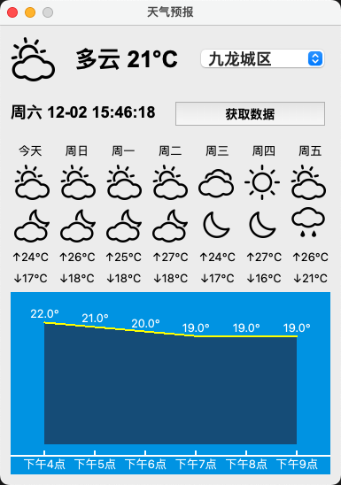
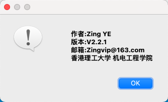

## *WeatherGUI*
<i style="text-align: center;"><a href="https://dev.qweather.com/">Development Platform</a></i>

## 软件界面

  
  

## 声明
- > 程序作者: **Zing YE (zingvip@163.com)**
- > API：https://dev.qweather.com

### 开源
- 本项目开源, 即:
  - 你可以在**注明来源版权信息**的情况下对源代码进行任意分发和修改以及衍生

### 已实现功能
- [x] 实时天气预报
- [x] 7天天气预报
- [x] 6小时温度曲线
- [x] 每隔10分钟更新一次天气
- [x] UI界面
- [x] 每两分钟截图一次
- [x] 保存50张图
- [ ] 界面美化

### 软件环境
 - colorlog==6.7.0
 - PyQt5==5.15.10
 - PyQt5_sip==12.13.0
 - pyqtgraph==0.13.3
 - Requests==2.31.0
 - ruamel.base==1.0.0
 - python==3.8.x 

## 联系方式
 - 邮箱: <zingvip@163.com>

